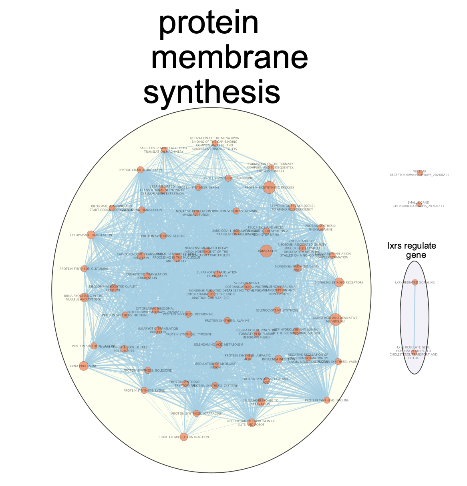
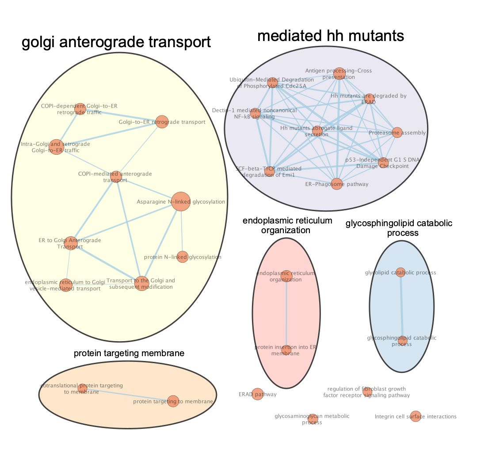

To get started with this assignment this chunk makes sure all of the required packages are installed and ready to be used in the following code. The differential expression analysis output from A1 is also loaded into the notebook.

```{r message=FALSE, warning=FALSE}
# installation chunk
packages <- c(
  "clusterProfiler",
  "enrichplot",
  "ggplot2",
  "dplyr",
  "readr",
  "knitr",
  "DT"
)

for (p in packages) {
  if (!requireNamespace(p, quietly = TRUE)) install.packages(p)
}
if (!requireNamespace("clusterProfiler", quietly = TRUE))
  BiocManager::install("clusterProfiler")
if (!requireNamespace("enrichplot", quietly = TRUE))
  BiocManager::install("enrichplot")

library(clusterProfiler)
library(enrichplot)
library(ggplot2)
library(dplyr)
library(readr)
library(knitr)
library(DT)

hits <- read_rds("data/A1_output.RDS")
set.seed(999)
dir.create("figures", showWarnings = FALSE)
dir.create("results", showWarnings = FALSE)
```

# Introduction

## Dataset description

In assignment 1 differential expression analysis was performed on gene expression data from an RNA-seq dataset of a cortisol treatment vs a vehicle control treatment on Human fibroblasts (GSE210302, Leung 2022). In the experimental design for generating the data, 100nM of cortisol (same level as present in vivo) was given to the cells over a period of up to 80 days, in culture media. Another sample was similarly grown in media, but treated instead with DMSO as a control. In the experiment these same conditions were repeated with relacorilant, an antagonist for the glucocorticoid receptor that cortisol often binds to. These cells were then sequenced using Illumina HiSeq 4000, to give the bulk RNAseq dataset being used. In the analysis, 6 cortisol and 5 control samples were used. The comparison of these datasets gives us insight into the genes and pathways that interact as a result of long term stress exposure, which has relevance to the biological effects of modern day high-stress environments. To study the specific biological pathways, thresholded ORA and non-thresholded GSEA were used to computationally identify the pathways activated and repressed due to chronic cortisol exposure.

## Summary of differential expression

In Assignment 1, normalized expression values were filtered for low-expression genes before differential expression analysis with limma (Ritchie 2015) and empirical Bayes moderation. Genes with low representation in the dataset were filtered from the set, which was quantified as genes with a log adjusted expression under 0.5 for less than 3 samples. Limma was then used to calculate differentially expressed genes, using the ebayes method between the two conditions. This resulted in 4871 genes with an adjusted p-value \< 0.05, meaning 4871 genes were deemed significantly different across the two conditions after factoring in multiple hypothesis testing. This included an abundance of both upregulated and downregulated genes, motivating a pathway analysis.

Here we set up the different filters for our differential expression analysis results. Sig_hits grabs all genes that were differentially expressed, and other subsets of the data are create for the thresholded enrichment analysis. Splitting up the positively and negatively differentially expressed genes can inform on which pathways are activating and deactivating due to the cortisol stimulus. By further dividing by logfc of 1 and -1, this new geneset captures the more extreme differentially expressed genes which allows for identifying pathways that are extremely activated rather than simply significantly activated.

```{r}
gene_list <- rownames(hits)
sig_hits <- hits[hits$adj.P.Val < 0.05,]
sig_genes <- rownames(sig_hits)
pos_hits <- sig_hits[sig_hits$logFC > 1,]
pos_genes <- rownames(pos_hits)
neg_hits <- sig_hits[sig_hits$logFC < -1,]
neg_genes <- rownames(neg_hits)
pos_hitsb <- sig_hits[sig_hits$logFC > 0,]
pos_genesb <- rownames(pos_hitsb)
neg_hitsb <- sig_hits[sig_hits$logFC < 0,]
neg_genesb <- rownames(neg_hitsb)
```

# Thresholded Over-Representation Analysis

## Methods

Thresholded over-representation was done to identify the strongest signalling gene pathways. Clusterprofiler (Xu 2024) was chosen as the tool for its ease of use, compatabilty with what we are trying to accomplish and its rnotebook compatability. The gene list selected for this analysis are the ones in the top hits list from the limma differential expression: Ones that have an adjusted p-value \< 0.05. The Bader Lab pathways list was used as a background for this enrichment analysis.

The represented pathways were calculated on the significant genes with a positive log fold change to represent genes that were being transrcibed more in the cortisol treatment, as well as separately ones with a negative log fold change to represent genes and pathways that were less active with a cortisol treatment. This was divided into different ORA runs at log fold change \> 0, \< 0, \> 1, \< -1 and all significant genes to extract different pieces of information. The +- 0 logfc shows that of the all genes pathway set which ones are being more expressed in the experimental samples or the control samples. The +- 1 logfc cutoff identifies a different set of genes, specifically ones that are very strongly showing up as differentially expressed, and thus the pathways associated with those genes. Additionally an over-representation analysis was done with all genes regardless of the log fold change which represents all significantly affected pathways by the cortisol treatment, whether positive or negative. A Q-value cutoff of 0.01 was chosen to limit to only the most significantly represented pathways since a lot were detected. Benjamini Hochberg method was used for multiple hypothesis correction.

```{r}
# Loading in the reference pathways

library(clusterProfiler)
dest_gmt_file <- "A2_material/Human_GOBP_AllPathways_noPFOCR_no_GO_iea_March_02_2026_symbol.gmt"
gene_sets <- read.gmt(dest_gmt_file)

```

```{r}
# Run basic thresholded analysis on all significantly expressed genes

library(clusterProfiler)

ora_all <- enricher(
  gene = sig_genes,
  TERM2GENE = gene_sets,
  pAdjustMethod = "BH",
  qvalueCutoff  = 0.01
)

ora_all_df <- as.data.frame(ora_all)
head(ora_all_df$Description, 20)
```

```{r}
# run thresholded enrichment on positively expressed genes
#logfc > 1
ora_plus <- enricher(
  gene = pos_genes,
  TERM2GENE = gene_sets,
  pAdjustMethod = "BH",
  qvalueCutoff  = 0.01
)

ora_plus_df <- as.data.frame(ora_plus)
head(ora_plus_df$Description, 20)

#logfc > 0 
ora_plusb <- enricher(
  gene = pos_genesb,
  TERM2GENE = gene_sets,
  pAdjustMethod = "BH",
  qvalueCutoff  = 0.01
)

ora_plus_dfb <- as.data.frame(ora_plusb)
head(ora_plus_dfb$Description, 20)
```

```{r}
# run thresholded enrichment on negatively expressed genes
ora_minus <- enricher(
  gene = neg_genes,
  TERM2GENE = gene_sets,
  pAdjustMethod = "BH",
  qvalueCutoff  = 0.01
)

ora_minus_df <- as.data.frame(ora_minus)
head(ora_minus_df$Description, 20)

ora_minusb <- enricher(
  gene = neg_genesb,
  TERM2GENE = gene_sets,
  pAdjustMethod = "BH",
  qvalueCutoff  = 0.01
)

ora_minus_dfb <- as.data.frame(ora_minusb)
head(ora_minus_dfb$Description, 20)

```

## Results

```{r}
print("Number of pathways")
print(paste("All significant genes:", nrow(ora_all_df)))
print(paste( "Logfc +-1 Positive genes:", nrow(ora_plus_df), " Negative genes:", nrow(ora_minus_df)))
print(paste( "Logfc +-0 Positive genes:", nrow(ora_plus_dfb), " Negative genes:", nrow(ora_minus_dfb)))
pathway_overlap <- intersect(c(ora_plus_dfb$Description, ora_minus_dfb$Description), ora_all_df$Description)
print(paste("Number of overlapping pathways:", length(pathway_overlap)))
print(paste("Overlapping pathways between positive and negative gene sets:", length(intersect(ora_plus_df$Description, ora_minus_df$Description))))

```

The over-representation shows 1078 pathways significantly differentiated and with 60 pathways being significantly upregulated and 114 being significantly downregulated in the dataset (logfc +-1). It is also apparent that the negative gene set produce substantially more significant pathways than the positive genes (224 vs 598), and of these pathways 596 overlap with the all genes pathways. This more speaks to which pathways are considered 'significant enough' to pass the strict qvalue filter, but shows that some pathways emerge when looking at different subsets of genes.

```{r, fig.width=10, fig.height=13}
dotplot(ora_all, showCategory = 12)
```

Figure 1. Output for all significant genes used for ORA analysis. This figure includes a mixture of both up-regulated and down-regulated pathways. With Mesenchymal transition being the most prominent one, protein targeting to membrane and many protein synthesis pathways.

```{r, fig.width=10, fig.height=13}
dotplot(ora_plus, showCategory = 12)
```

Figure 2. Positively expressed gene pathways logfc \> 1. These pathways are strongly upregulated in the chronic treatment with cortisol. Some themes include extracellular activity such as tube development, and circulatory systems while also the negative regulation of movement.

```{r, fig.width=10, fig.height=13}
dotplot(ora_plusb, showCategory = 12)
```

Figure 3. Positively expressed gene pathways logfc \> 0. There is a complete dominance by various protein synthesis pathways as the most significantly represented groups.

```{r, fig.width=10, fig.height=13}
dotplot(ora_minus, showCategory = 12)
```

Figure 4. Negatively expressed genes with logfc \< -1. These pathways are strongly shut off in the presence of cortisol. Notable pathways include adhesion, migration and synaptic signalling.

```{r, fig.width=10, fig.height=13}
dotplot(ora_minusb, showCategory = 14)
```

Figure 5. Negatively expressed pathways with logfc \< 0. Strong presence of pathways involving membrane functionality and intracellular transport.

# Interpretation of Thresholded Analysis

Each ORA analysis gives a slightly different set of pathways which represents a different group of genes being identified as differentially expressed. The pathways that emerged from all_genes show the baseline of which significant genes are represented

The pathways in the positive gene sets represent the pathways that had more activity in the cortisol treatment. For logfc \> 0, similarly to the all genes analysis, the protein synthesis pathways dominant the most significant sets. This suggests that cells under stress go through much higher protein turnover which requires an increase in synthesis pathways. This is supported by experimental evidence that showed evidence that effects from glucocorticoids were mediated using protein synthesis (Pratt 1978). This has an interesting but potentially contradictory connection to a study done in mice neurons that showed a downregulation in protein synthesis pathway in chronic stress conditions (Calabrese 2017). This does shows us evidence that cortisol is able to affect protein translation, but leaves us with a question of perhaps for some cell types this reduces production while in others it increases. Although this is something we are unable to fully extract from this dataset. These pathways are clearly an important part of cellular response to stress. 

Interestingly these pathways do not show up when the gene set is restricted to ones with logfc \> 1. This implies even if the signal is reliable and significant, those genes are being upregulated only to a certain amount. Instead we see gene sets relating to negative regulation of movement and vascular system being strongly upregulated in the data. These directly relate to the role of fibroblasts, as these cells play a key role in tissue structure and development. This suggests that cortisol shifts fibroblasts towards more structural focus and less of a migratory state, which connects with their role in wound healing.

For the other side, the pathways that emerge from negatively differentially expressed gene sets represent the pathways that were turned off in the chronic presence of cortisol. At a less restrictive logfc \< 0, the pathways that are expressed at higher levels are strongly relating to membrane, adhesion and golgi/intracellular transport pathways, suggesting that the cortisol alters and likely slows down the transport processes within the cell, creating a more internally focused state. This is a different set of genes to the \< -1 logfc gene set pathways which include adhesion again, positive regulation of cell migration, and synaptic transmission. This implies that the genes relating to these pathways have their transcription significantly reduced in the presence of cortisol. An interesting derivation from this is the synaptic transmission pathways as it suggests that chronic stress affects neurological processes which could potentially have long term effects, a claim which is backed up by studies that show chronic stress weakens connectivity in the prefrontal cortex (Woo 2021).

Of course this is only a small proportion of the 1000+ enrichment pathways deemed significant, which shows how wide of an effect the cortisol treatment has on the cells. Because of this, it is hard to pin down precise biological conclusions, but certain cellular behaviors in protein production, intracellular transport, membrane behavior, and extra cellular organization are clearly being affected by the treatment.

# Non-Thresholded Gene Set Enrichment Analysis

## Methods

To perform a non-thresholded enrichment analysis, the clusterprofiler gsea algorithm was used for its easy r notebook integration. MinGSSize of 10 and maxGSSize of 500 were chosen as standard options to decrease noise from overly sensitve gene sets because they are small or less biologically meaningful pathways that are too large. A pvalue cutoff of 0.025 was used to reduce less significant noise pathways while not being too restrictive. Since this set has a lot of differentially expressed genes this felt like an appropriate tradeoff. The Limma t-value (a moderated T-statistic) was used for ranking the genes for the gsea.

```{r}
set.seed(999)
gene_list <- hits$t
names(gene_list) <- rownames(hits)
gene_list <- sort(gene_list, decreasing = TRUE)

gsea <- GSEA(
  geneList = gene_list,
  TERM2GENE = gene_sets,
  minGSSize = 10,
  maxGSSize = 500,
  pvalueCutoff = 0.025
)

gsea_df <- as.data.frame(gsea)
head(gsea_df$Description, 25)

write.csv(gsea_df, file = "gsea_output.csv")

```

## Results

```{r, fig.width=10, fig.height=13}
dotplot(gsea, showCategory = 15)
```

Figure 6. Top GSEA results. The pathways most expressed in the gsea analysis were the protein synthesis pathways.

## Analysis

```{r}
cat("Upregulated pathways:", nrow(gsea_df[gsea_df$NES > 0,]), "\nDownregulated pathways:", nrow(gsea_df[gsea_df$NES < 0,]), "\nTotal pathways:", nrow(gsea_df))
```

Overall 123 upregulated pathways and 220 pathways were detected as significant in the geneset resulting in 343 total pathways. Of these pathways, the protein synthesis pathways were once again the most dominant pathways

```{r}
print("Postitive Pathways")
head(gsea_df$Description[gsea_df$NES > 0], 35)
print("Negative Pathways")
head(gsea_df$Description[gsea_df$NES < 0], 35)
```

Of the positive genes from the gsea, similar themes to the ORA analysis show up as significant. This included the protein synthesis pathways and pathways related to metabolism. This suggests that the presence of cortisol causes protein turnover and energy to be consumed, perhaps to try and fix the stressed state. On the negative side there is a strong significant expression in pathways relating to intracellular transport, extracellular activity/interactions and cell cycle pathways. These results combined show that the cells under stress behave in a way that promotes fixing the problem that is causing the cortisol signalling internally and trying to reduce the direct interaction with other cells. These results showing up in the GSEA indicates not only a subset of differentially expressed genes, but wider cooridnated changes to the cellular biology.

# Cytoscape Enrichment Map Visualization

Here we use Cytoscape to visualize how the differentially expressed biological pathways connect with each other to identify common themes in gene regulation under cortisol condition. This chunk of code adapts the geneprofiler gsea output to be used by Enrichment Map input.

```{r}
library(dplyr)

gsea_clean <- gsea_df %>% 
  dplyr::select(
    ID,
    Description,
    NES,
    pvalue,
    p.adjust,
    core_enrichment
  )

gsea_clean$phenotype <- ifelse(gsea_clean$NES > 0, 1, -1)
gsea_clean <- gsea_clean %>%
  dplyr::rename(
    pval = pvalue,
    FDR = p.adjust,
    genes = core_enrichment
  )

gsea_clean$genes <- gsub("/", " ", gsea_clean$genes)
gsea_clean2 <- gsea_clean %>%
  dplyr::filter(FDR < 0.01 & NES < -2)

gsea_clean3 <- gsea_clean %>%
  dplyr::filter(FDR < 0.01 & NES > 2)

write.table(
  gsea_clean2,
  file = "gsea_for_cytoscape2.txt",
  sep = "\t",
  quote = FALSE,
  row.names = FALSE
)

write.table(
  gsea_clean3,
  file = "gsea_for_cytoscape3.txt",
  sep = "\t",
  quote = FALSE,
  row.names = FALSE
)

write.table(
  gsea_clean,
  file = "gsea_for_cytoscape.txt",
  sep = "\t",
  quote = FALSE,
  row.names = FALSE
)

```

## Enrichment Map

The enrichment map tool was used to visualize the key features of the GSEA. To keep relevant pathways the cytoscape was split into pathways with NES \> 2 and NES \< -2. The graph with all pathways was too messy to derive conclusions.

## Network Annotation

Autoannotate was used to provide insight into what the groups in the enrichment map actually are. Here are the results from the autoannotate:

```{r}

```

Figure 7. Enrichment Map output from cytoscape. Pathways with NES \> 2. Clear dominance of theme of protein membrane synthesis. Lxrs appears as a secondary theme which relates to lipid metabolism.

```{r}

```

Figure 8. Enrichment Map output from cytoscape. Pathways with NES \< -2. Key themes of golgi transportation, mutational control and other internal pathways. The HH mutants path affects cell growth and development.

## Interpretation of GSEA Results

This shows the most significant pathways fall into the categories of Golgi intracellular transportation (downregulated), and protein production (upregulated). This suggests a coordinated change in transcriptional programming, that compared to normal conditions, the presence of cortisol signalling causes a change in cellular transportation while increasing the amount of protein production that it does. The other pathways present in the gsea show the wide range of changes that happen to the cell, but a key theme that recurs is that the cells behavior and processes are widely changing in the cortisol treatment context.

# Discussion

## Comparison to ORA

Since the threshold and non-threshold lists give different gene lists, we can run a simple overlap experiment to see which ones are present in both lists. Since the two lists contain the detection of slightly different signals, the intersection between the two includes the pathways that have the strongest gene signals from the ORA and the subtle gene interactions from the GSEA.

```{r}
conserved_pathway <- intersect(gsea_df$Description, ora_all_df$Description)
cat("Number of conserved pathways between ORA and GSEA:", length(conserved_pathway), "\n")
print("Differing pathways:")
head(setdiff(gsea_df$Description, conserved_pathway), 10)
```

This shows that 218 of the pathways in the GSEA (out of 343), were present in both the ORA and the GSEA. This meant that a lot of pathways show up with a strong enough signal to be significant in both pathways. With 10 sampled pathways that were not in the ORA but were in the GSEA, there isn't a clear connection between them suggesting that it is more of the strength of the signal over the type of the signal that causes one analysis to pick it up and not the other.

## Takeaways

The GSEA analysis and the ORA analysis both detected a wide range of pathways, suggesting that cortisol pathways affect many different functionalities of the cell. However, protein production, metabolic processes, membrane related pathways and transportation related pathways are reoccurring themes that appear to be regulated by these pathways. Together these paint a picture that cortisol signalling pathways reprogram cell behavior and change the energy priorities, which is further shown through activation of differentiation pathways. Additionally, extracellular behaviors such as reduced cellular adhesion are consistent with behaviors described in the paper (Leung 2022). These processes suggest the stress-adaptive phenotypes cause resourcers to be directed to internal processes over tissue-level processes. As shown throughout the paper, these results have consistency with known cortisol biology on fibroblasts, and this analysis is able to start to capture various pathways interacting together.

Stress is a fascinating condition as it is bridges the mental systems and physical systems. The effects of chronic stress are relevant to the modern day lifestyle, and these results suggest that high levels of prolonged stress can affect a wide variety of cellular behaviors.

# References

Calabrese F, Brivio P, Gruca P, Lason-Tyburkiewicz M, Papp M, Riva MA. Chronic mild stress-induced alterations of local protein synthesis: A role for cognitive impairment. ACS Chemical Neuroscience. 2017;8(4):817–825. doi:10.1021/acschemneuro.6b00392

Leung CS, Kosyk O, Welter EM, Dietrich N, Archer TK, Zannas AS. Chronic stress-driven glucocorticoid receptor activation programs key cell phenotypes and functional epigenomic patterns in human fibroblasts. iScience. 2022;25(9):104960. doi:10.1016/j.isci.2022.104960

Pratt WB. The mechanism of glucocorticoid effects in fibroblasts. Journal of Investigative Dermatology. 1978;71(1):24–35. doi:10.1111/1523-1747.ep12543774

Ritchie ME, Phipson B, Wu D, Hu Y, Law CW, Shi W, Smyth GK. limma powers differential expression analyses for RNA-sequencing and microarray studies. Nucleic Acids Research. 2015;43(7):e47.

Xu S, Hu E, Cai Y, Xie Z, Luo X, Zhan L, Tang W, Wang Q, Liu B, Wang R, Xie W, Wu T, Xie L, Yu G. Using clusterProfiler to characterize multiomics data. Nature Protocols. 2024;19(11):3292–3320.

Woo E, Sansing LH, Arnsten AFT, Datta D. Chronic stress weakens connectivity in the prefrontal cortex: Architectural and molecular changes. Chronic Stress. 2021;5. doi:10.1177/24705470211029254

Yu G. enrichplot: Visualization of functional enrichment result. 2025. doi:10.18129/B9.bioc.enrichplot


